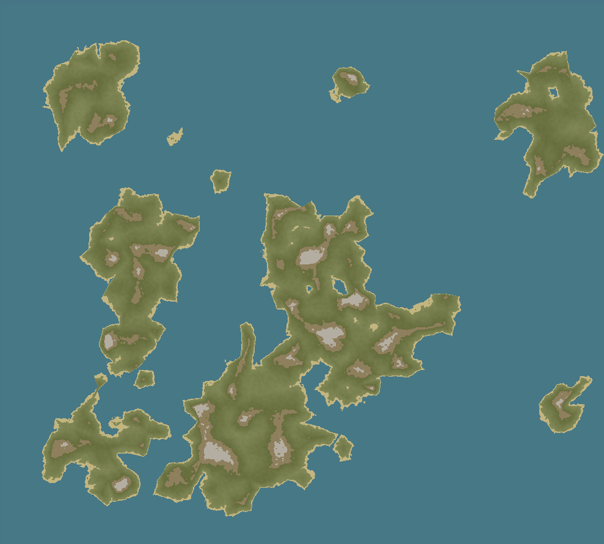

  
  <h1>Hodos</h1>

## An artistic procedural world map generator
Hodos is a simple client-side procedural world map generator running on JavaScript and WebGL. It combines both voronoïd cells and noise based algorithms to generate pseudo-random unique maps.

  

A public instance is available at [hodos.soremo.eu.org](https://hodos.soremo.eu.org/).

*Hodos, voyagez avec audace !*

Hodos creates maps for your imagination to thrive.
